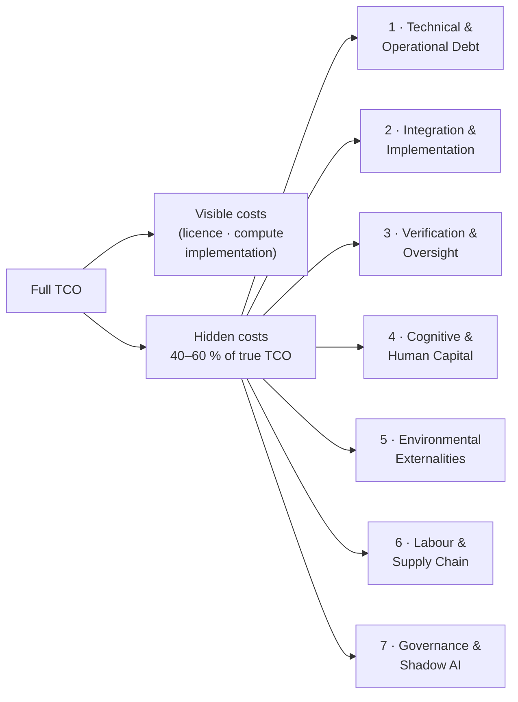

# Indirect Costs of AI: Taxonomy Overview

## The 40–60% Thesis

Research consistently finds that the costs organisations can directly observe — subscription fees, compute bills, initial implementation invoices — represent between 40% and 60% of the true total cost of owning and operating an AI system. The remainder is distributed across categories that rarely appear on the initial business case, are difficult to attribute once incurred, and compound over time.

This is not a finding about exceptional projects. It is a finding about the average. Gartner's analysis (via Anyreach 2026) and independent meta-analysis (Meta-Intelligence 2025, citing research) converge on the same range. The organisations that discover this the hard way are not poorly managed — they are using the standard tools of AI valuation, which were not designed to surface these costs.

The indirect-cost taxonomy in ValorAI organises these costs into seven categories. Each category has a dedicated page with a literature review, a statement of how the cost should be treated in a TCO model, and citations to primary sources.

!!! tip "Sector calibration"
    Which categories matter most depends on the deployment context. The [Sector Lenses](../sector-lenses.md) page provides directional priors for six sectors — showing where to focus analysis before committing to a full TCO build.

---

## Seven Categories

### 1. [Technical & Operational Debt](technical-debt.md)
Machine learning systems accumulate a distinctive form of technical debt — not just code debt, but data-dependency debt, boundary erosion, hidden feedback loops, and configuration complexity. The maintenance burden of a production ML system typically exceeds the cost of its initial construction within 12–18 months. Sculley et al. (2015) established this empirically at NeurIPS; the finding has been widely replicated.

### 2. [Integration & Implementation](integration-implementation.md)
The cost of connecting an AI system to existing organisational data, workflows, and decision processes routinely equals or exceeds the visible tool cost. Industry analysis suggests 2–3× total cost expansion beyond initial budget is the expected outcome, not the pessimistic one. Internal AI builds stall at roughly three times the rate of externally-integrated tools, primarily because integration complexity is underestimated at the outset.

### 3. [Verification & Oversight](verification-oversight.md)
AI systems do not produce outputs that can be trusted without review in most operational contexts. The human time required to validate, correct, or discard AI-generated outputs — the "verification tax" — substantially erodes the efficiency gains projected at procurement. In knowledge-work settings, studies find that workers often spend more time checking AI output than they would have spent completing the task manually.

### 4. [Cognitive & Human Capital](cognitive-human-capital.md)
Sustained AI use is associated with measurable reductions in critical thinking, independent problem-solving, and the tacit organisational knowledge that underpins complex judgement. Gerlich (2025) found a negative correlation between AI tool use and critical-thinking scores across 666 participants. Natali et al. (2025) document analogous deskilling effects in medical AI adoption. ROI models that project productivity gains from staff assume those staff retain the skills and judgement they currently possess; this assumption erodes over time.

### 5. [Environmental Externalities](environmental-externalities.md)
AI is a material system with physical infrastructure requirements: data centres consume electricity, water, and land; hardware has embodied carbon and generates e-waste at end of life. The UN University INWEH (2025) frames AI's environmental cost as a justice issue, not merely an engineering one. Carbon pricing, water-stress siting risk, and mandatory disclosure regulation are converting what were once externalities into operational costs.

### 6. [Labour & Supply Chain](labour-supply-chain.md)
The performance of AI systems depends on a largely invisible global labour force — data annotators, content moderators, reinforcement-learning trainers — whose working conditions, wage levels, and exposure to harmful content are documented by Gray and Suri (2019) and subsequent researchers. ESG investors, regulators, and courts are increasingly treating these supply-chain risks as material. Legal exposure, reputational cost, and audit overhead are the financial form in which this indirect cost appears.

### 7. [Governance & Shadow AI](governance-shadow-ai.md)
MIT NANDA's *The GenAI Divide* (2025) reports that approximately 90% of workers use personal AI tools at work, versus roughly 40% who use officially-provisioned tools. This "shadow AI economy" represents a governance blind spot: sensitive organisational data is processed by unmanaged systems, AI outputs are incorporated into work products without audit trails, and intellectual property boundaries become uncertain. The cost appears as compliance risk, data-breach exposure, and the overhead of remediation when shadow use is discovered.

---

## How These Costs Enter the Valuation Model

In the [Valuation Models](../methodology/valuation-models.md) page, these seven categories are structured as Tier 2 explicit line items in the TCO calculation. The starting estimate for their aggregate share is 40–60% of Tier 1 visible costs, calibrated by the base-rate evidence in [Base Rates](../evidence/base-rates.md). Individual categories are then scaled by the specific characteristics of the deployment: scale, data sensitivity, sector regulatory environment, and existing organisational capabilities. The [Sector Lenses](../sector-lenses.md) page provides qualitative guidance on which categories are most salient for six common deployment sectors.

The point is not to inflate cost estimates. It is to make the full decision visible.

---

## References

- Anyreach (2026). *The Hidden Costs of AI in Business.* — 40–60% hidden cost share; 2–3× cost expansion.
- Meta-Intelligence (2025). *State of AI in Business.* — Independent meta-analysis converging on same range.
- Sculley, D. et al. (2015). *Hidden Technical Debt in Machine Learning Systems.* NeurIPS 28, pp. 2503–2511.
- MIT NANDA (2025). *The GenAI Divide: State of AI in Business 2025.*
- Gray, M. L. & Suri, S. (2019). *Ghost Work.* Harper Collins.
- United Nations University INWEH (2025). *Environmental Cost of Artificial Intelligence.*
